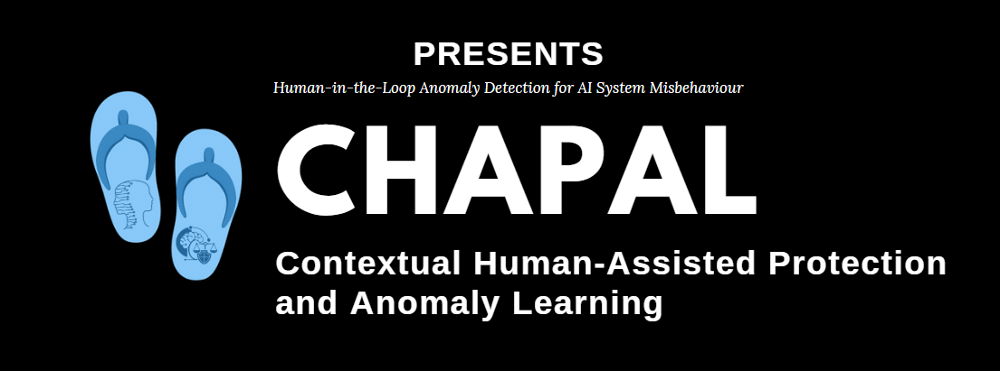
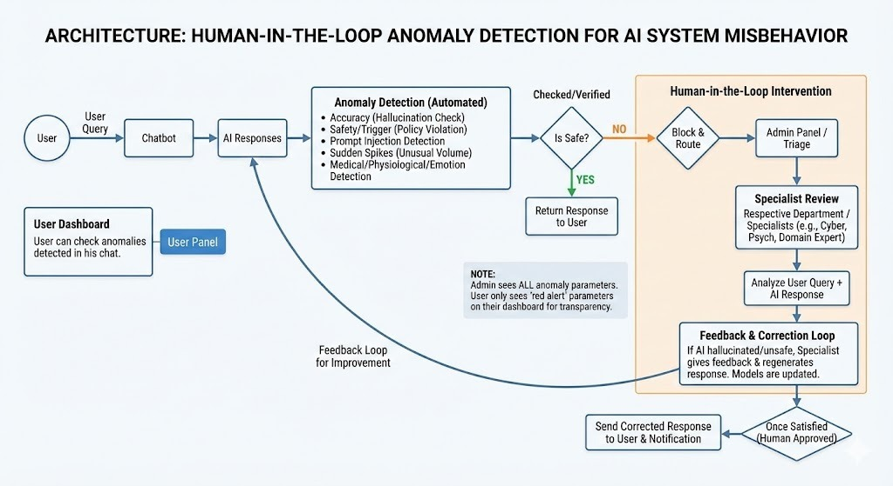
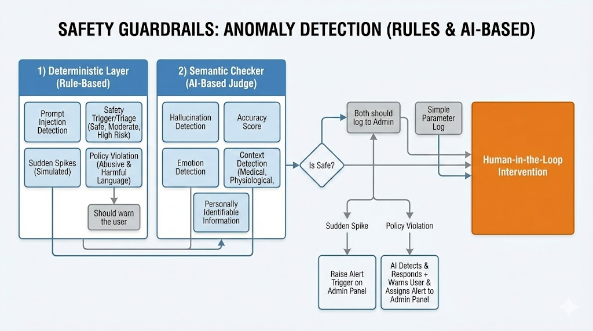

<div align="center">



#


</div>

---

## 🛡️ Project Overview

**CHAPAL** is a cutting-edge **AI Safety & Auditing Platform** designed to solve the critical challenge of trust in Large Language Models (LLMs). By combining deterministic rule sets with semantic understanding, CHAPAL acts as a firewall between users and AI, ensuring every interaction is safe, accurate, and compliant.

Unlike traditional "black box" filters, CHAPAL introduces a **Human-in-the-Loop (HITL)** workflow, allowing experts to review blocked content, correct hallucinations, and fine-tune the system in real-time.

---

## 🏗️ System Architecture

Our **Dual-Layer Detection System** ensures robust protection without compromising speed.



1.  **Layer 1 (Deterministic Guard):** Instantly mitigates high-velocity threats like DDoS attacks, PII leaks, and known injection patterns using regex and heuristic logic.
2.  **Layer 2 (Semantic Auditor):** Powered by **Llama 3.1 (via Groq)**, this layer "reads" the conversation to detect subtle nuances like hostile tone, medical advice, hallucinations, and psychological distress.

---

## 🌟 Key Features

- **⚡ Real-Time Anomaly Detection**:
  - **Prompt Injection**: Detects attempts to jailbreak the model (e.g., "Ignore previous instructions").
  - **Hallucination Check**: Cross-references AI responses for factual consistency.
  - **Policy Enforcement**: Blocks Medical/Legal advice and Toxic content.
- **👩‍💻 Human-in-the-Loop Intervention**:
  - Admins can **Approve**, **Block**, or **Rewrite** flagged responses.
  - " Rewrite" actions create a feedback loop, improving the model over time.
- **📊 Transparent Analytics**:
  - **Safety Score**: Live 0-100 metric for every session.
  - **Emotion Recognition**: Tracks user sentiment intensity.
- **🔧 Developer Simulation Tools**:
  - Built-in toolbar to simulate attacks (DDoS, Self-harm, PII) for testing defenses.



---

## 📚 Documentation Index

We maintain modular documentation to help you get started quickly.

| Guide                                              | Audience   | Description                                            |
| :------------------------------------------------- | :--------- | :----------------------------------------------------- |
| **[🏛️ System Architecture](docs/ARCHITECTURE.md)** | Architects | Deep dive into the Dual-Layer Pipeline and Tech Stack. |
| **[📖 User Guide](docs/USER_GUIDE.md)**            | End Users  | How to use the Chat Interface and Simulation Toolbar.  |
| **[👮 Admin Guide](docs/ADMIN_GUIDE.md)**          | Admins     | Triage dashboard workflows and HITL best practices.    |

> **Live Docs:** You can also view the documentation securely within the app at [`/docs`](http://localhost:3000/docs).

---

## 🚀 Getting Started

### Prerequisites

- Node.js 18+
- PRISMA with MONGO
- API Keys for Google Gemini & Groq

### Installation

1.  **Clone the repository**

    ```bash
    git clone https://github.com/Kaleemullah-Younas/CHAPAL.git
    cd chapal
    ```

2.  **Install dependencies**

    ```bash
    npm install
    ```

3.  **Set up environment variables**
    Create a `.env` file based on `.env.example` and add your database and API keys.

4.  **Initialize Database**

    ```bash
    npx prisma generate
    npx prisma db push
    ```

5.  **Run the development server**
    ```bash
    npm run dev
    ```
